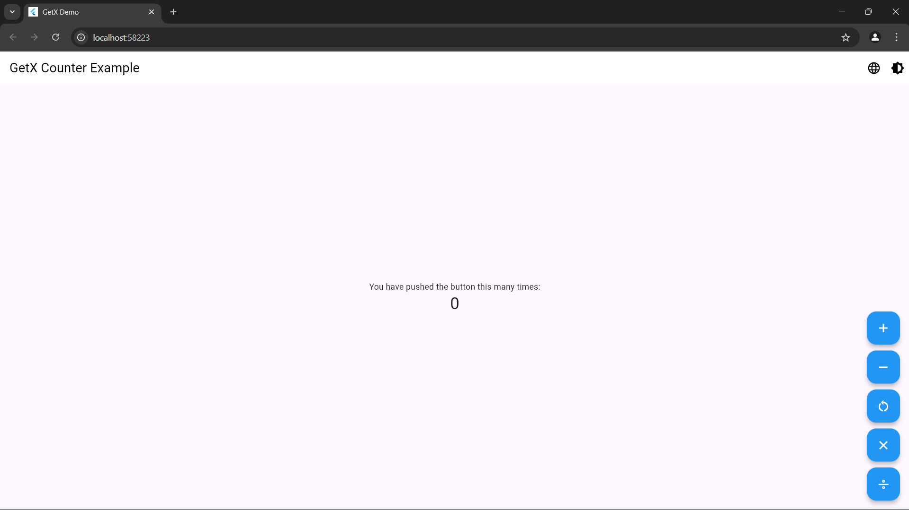

# GetX Counter App - Feature Showcase

Este proyecto demuestra las principales características y mejores prácticas de GetX en Flutter, implementadas en una aplicación de contador mejorada.

## 🌟 Características Implementadas

### 1. Gestión de Estado (State Management)
- **Estado Reactivo**: Uso de `.obs` para variables reactivas
  ```dart
  var count = 0.obs;
  var isDarkMode = false.obs;
  ```
- **Observadores de Estado**: Implementación de `ever()` para monitorear cambios
- **Actualizaciones Automáticas**: La UI se actualiza automáticamente sin necesidad de setState()
- **Snackbars Reactivos**: Notificaciones automáticas al actualizar el contador

### 2. Internacionalización (i18n)
- **Soporte Multiidioma**: Inglés y Español implementados
- **Cambio Dinámico**: Botón en AppBar para cambiar idioma en tiempo real
- **Traducciones Estructuradas**: Sistema organizado de traducciones
  ```dart
  'counter_title'.tr  // Uso de traducciones
  ```

### 3. Gestión de Temas
- **Tema Claro/Oscuro**: Soporte completo para ambos temas
- **Cambio Dinámico**: Toggle de tema en AppBar
- **Persistencia**: El tema seleccionado persiste entre sesiones

### 4. Sistema de Rutas
- **Rutas Nombradas**: Implementación de sistema de rutas GetX
  ```dart
  GetPage(
    name: '/',
    page: () => CounterPage(),
    binding: CounterBinding(),
  )
  ```
- **Bindings**: Inyección de dependencias automática
- **Navegación Limpia**: Uso de Get.to(), Get.back(), etc.

### 5. Inyección de Dependencias
- **Bindings**: Inicialización automática de controladores
- **Lazy Loading**: Carga eficiente de recursos
- **Get.find()**: Acceso global a controladores
  ```dart
  final CounterController controller = Get.find<CounterController>();
  ```

### 6. Características de UI
- **Diálogos**: Popup al alcanzar 10 conteos
- **Snackbars**: Notificaciones elegantes
- **Tooltips**: Ayudas visuales en botones
- **Responsive**: Diseño adaptable

## 🚀 Funcionalidades del Contador

1. **Incremento/Decremento**
   - Botones + y - para modificar el contador
   - Snackbar de confirmación en cada cambio

2. **Multiplicación**
   - Botón × para multiplicar por 2
   - Validación y feedback visual

3. **Reset**
   - Botón de reinicio a 0
   - Confirmación visual

4. **Logros**
   - Dialog especial al llegar a 10
   - Sistema de feedback al usuario

## 📁 Estructura del Proyecto

```
lib/
├── main.dart                # Punto de entrada de la aplicación
├── bindings/               # Inyección de dependencias
├── controllers/            # Lógica de negocio
├── routes/                 # Configuración de rutas
├── themes/                 # Temas de la aplicación
├── translations/           # Archivos de idiomas
└── views/                  # Interfaces de usuario
```

## 🛠️ Tecnologías Utilizadas

- **Flutter**: Framework base
- **GetX**: Gestión de estado y utilidades
- **Material Design**: Sistema de diseño

## 🔧 Instalación

1. Clona el repositorio
   ```bash
   git clone [url-del-repositorio]
   ```

2. Instala las dependencias
   ```bash
   flutter pub get
   ```

3. Ejecuta la aplicación
   ```bash
   flutter run
   ```

## 💡 Mejores Prácticas Implementadas

1. **Separación de Responsabilidades**
   - Controllers para lógica de negocio
   - Views para presentación
   - Bindings para inyección de dependencias

2. **Código Limpio**
   - Nombres descriptivos
   - Funciones pequeñas y específicas
   - Comentarios relevantes

3. **Patrón de Diseño**
   - Implementación del patrón GetX
   - Arquitectura modular
   - Fácil mantenimiento

## 🔄 Flujo de Datos

```
View -> Controller -> Estado
Estado -> Controller -> View (Actualización automática)
```

## 📱 Screenshots




## ✨ Próximas Mejoras

- [ ] Persistencia de datos con GetStorage
- [ ] Middleware para rutas protegidas
- [ ] Animaciones personalizadas
- [ ] Integración con APIs usando GetConnect
- [ ] Tests unitarios y de widgets

